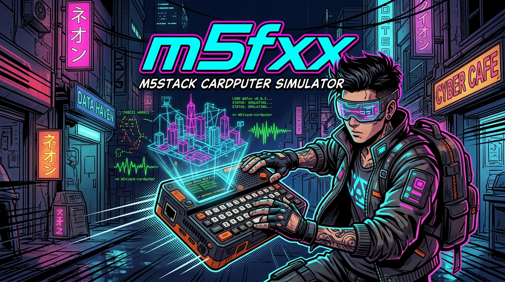

<div align="center">



# m5fxx — M5Stack Cardputer Desktop Simulator

[](https://www.rust-lang.org/)
[](https://github.com/pepperonas/m5fxx)
[](https://opensource.org/licenses/MIT)
[](https://github.com/pepperonas/m5fxx)
[](https://docs.m5stack.com/en/core/Cardputer)
[](https://github.com/pepperonas/m5fxx)
[](https://github.com/pepperonas/m5fxx)

*Ein hochperformanter, plattformübergreifender Desktop-Simulator für M5Stack-Cardputer-Firmware mit nativer Benutzeroberfläche in Rust (`eframe`/`egui`).*

[Features](#1-features--highlights) • [Hardware-Status](#2-hardware-status-unterstützt-vs-ausstehend) • [Schnellstart](#3-schnellstart--terminal-alias) • [Architektur](#4-architektur--firmware-integration) • [Plattformen](#5-plattform-support--builds)

</div>

---

## 1. Features & Highlights

- 🕹️ **Maßstabsgetreues Gehäuse:**
  - Realistische Vektordarstellung basierend auf den offiziellen M5Stack-Spezifikationen (84.0 × 54.0 × 19.7 mm).
  - Skalierbar ohne Unschärfe, vollständige Retina- und HiDPI-Unterstützung.
  - Detailreich mit perforiertem Lautsprechergrille, Schrauben, M5Stack-Branding und interaktivem **BtnG0**-Taster.
- 📺 **ST7789V2 IPS LCD Emulation:**
  - Echte Hardware-Auflösung von 240 × 135 Pixeln mit RGB565-Farbraum.
  - **Nearest-Neighbor GPU-Texturierung:** Absolut scharfe Pixel-Optik ohne verwaschene Filter.
  - **Zoomed Display Only Modus:** Großansicht des reinen Displays mit ganzzahligem Skalierungsfaktor (Integer Scaling).
- ⌨️ **Vollständige 56-Tasten-Tastatur:**
  - Exakte 4×14 Tastenmatrix inklusive Primary-, Shift/Aa- und Fn-Ebenen.
  - Klickbare Buttons mit Tastendruck-Hervorhebung.
  - Physisches Host-Tastatur-Mapping (QWERTZ & QWERTY, Pfeiltasten, Sonderzeichen).
  - **Focus-Loss-Safety:** Schutz vor hängenden Tasten bei Fensterfokus-Wechsel.
- 💾 **MicroSD-Speicherkarte mit Sandbox:**
  - Abbildung auf ein konfigurierbares Host-Verzeichnis.
  - Zuverlässiger Schutz vor Directory-Traversal-Angriffen (`../` oder Ausbrüche blockiert).
- 🛠️ **Integriertes Entwickler-Panel:**
  - Simulation pausieren & fortsetzen.
  - Firmware- und HAL-Reset.
  - Live-Anzeige gedrückter Tasten & Modifier (`Fn`, `Shift`, `Ctrl`, `Opt`, `Alt`).
  - Native Ordnerauswahl für die virtuelle SD-Karte via Dateidialog.
  - Umschaltung zwischen **Original Cardputer** (GPIO-Matrix) und **Cardputer ADV** (TCA8418 I²C-Controller).

---

## 2. Hardware-Status: Unterstützt vs. Ausstehend

| Hardware-Komponente | Status | Implementierungsdetails |
| :--- | :---: | :--- |
| **ST7789V2 Display (240×135)** | ✅ **Vollständig** | RGB565 Framebuffer, Primitiven, Font, GPU Nearest-Neighbor |
| **56-Tasten-Tastatur** | ✅ **Vollständig** | 4×14 Matrix, Host-Keyboard-Mapping, Klickflächen, Modifier |
| **G0-Taster (BtnG0)** | ✅ **Vollständig** | Klickbar, Download/Action-Button der Firmware |
| **MicroSD-Slot** | ✅ **Vollständig** | Lokaler Sandboxed Ordner, Traversal-Protection |
| **System-Uhr & Timer** | ✅ **Vollständig** | Monotone `millis()`, `micros()`, Frame-Delta `dt` |
| **Akku / Power-Status** | ✅ **Simuliert** | Spannung (mV), Prozentwert, Ladeerkennung |
| **NS4168 1W Lautsprecher** | ⚠️ **Vorbereitet** | HAL-Audio-Stubs vorhanden, DSP/Tone-Erweiterung möglich |
| **SPM1423 PDM Mikrofon** | ⚠️ **Vorbereitet** | Virtuelle Audiopuffer-Schnittstelle vorbereitet |
| **Wi-Fi / ESP-NOW / BLE** | ❌ **Nicht implementiert** | Wird im UI explizit als nicht unterstützt deklariert |
| **Grove HY2.0-4P / GPIOs** | ❌ **Nicht implementiert** | Externe Hardware-Pins nicht simuliert |

---

## 3. Schnellstart & Terminal-Alias

### Starten über Terminal-Alias
Wenn du den Alias `m5` in deiner Shell eingerichtet hast:
```bash
m5
```

### Manueller Start über Cargo
```bash
# Debug-Build
cargo run -p m5fxx-desktop

# Optimierter Release-Build
cargo run --release -p m5fxx-desktop
```

---

## 4. Architektur & Firmware-Integration

Das Projekt ist modular als **Cargo-Workspace** aufgebaut:

```text
m5fxx/
├── assets/                  # Hero Banner & Ressourcen
├── crates/
│   ├── m5fxx-core/          # Hardware Abstraction Layer, RGB565, Input & SD Sandbox
│   ├── m5fxx-app-demo/      # Hardware-agnostische Beispielanwendung (Firmware)
│   └── m5fxx-desktop/       # eframe/egui GUI Desktop-Simulator
├── include/
│   └── m5fxx_abi.h          # C-ABI Header für native C/C++ Firmware-Integration
├── Cargo.toml               # Workspace Konfiguration
└── README.md
```

### Integration eigener Firmware

#### A. Firmware in Rust
Nutze `m5fxx-core` als gemeinsame Abhängigkeit:
```toml
[dependencies]
m5fxx-core = { git = "https://github.com/pepperonas/m5fxx" }
```
Deine Firmware implementiert ihre Logik gegen `CardputerHal`. Auf dem Desktop läuft sie im Simulator, auf der echten Hardware mit `esp-hal` oder `esp-idf-hal`.

#### B. Firmware in C oder C++
Für bestehende Arduino- oder ESP-IDF-Codebasen liegt der schlanke C-Header [`include/m5fxx_abi.h`](include/m5fxx_abi.h) bereit:
1. Kompiliere deine hardware-unabhängigen Firmware-Module (Menüs, Logik) als native Library.
2. Verbinde den Framebuffer (`get_framebuffer()`) und Key-Events (`m5fxx_key_event_t`) über die definierte C-ABI.
3. Kein Nachprogrammieren riesiger Arduino-Bibliotheken erforderlich.

---

## 5. Plattform-Support & Builds

| Betriebssystem | Architektur | Status | Build-Kommando |
| :--- | :--- | :---: | :--- |
| **macOS** | Apple Silicon (M1–M4) | ✅ Verifiziert | `cargo build --release -p m5fxx-desktop` |
| **macOS** | Intel x86_64 | ✅ Verifiziert | `cargo build --release -p m5fxx-desktop` |
| **Linux** | Ubuntu, Debian, Fedora, Arch | 🐧 Quellcode-kompatibel | `cargo build --release -p m5fxx-desktop` |
| **Windows** | x86_64 MSVC | 🪟 Quellcode-kompatibel | `cargo build --release -p m5fxx-desktop` |

### Linux Abhängigkeiten (Ubuntu/Debian)
```bash
sudo apt-get update
sudo apt-get install -y libxcb-render0-dev libxcb-shape0-dev libxcb-xfixes0-dev libxkbcommon-dev libssl-dev
```

---

## 6. Tests & Code-Qualität

```bash
# Alle Workspace-Tests ausführen
cargo test --workspace

# Linter & Formatierung
cargo clippy --workspace -- -D warnings
cargo fmt --all -- --check
```

---

## Lizenz

Dieses Projekt steht unter der [MIT-Lizenz](LICENSE).
