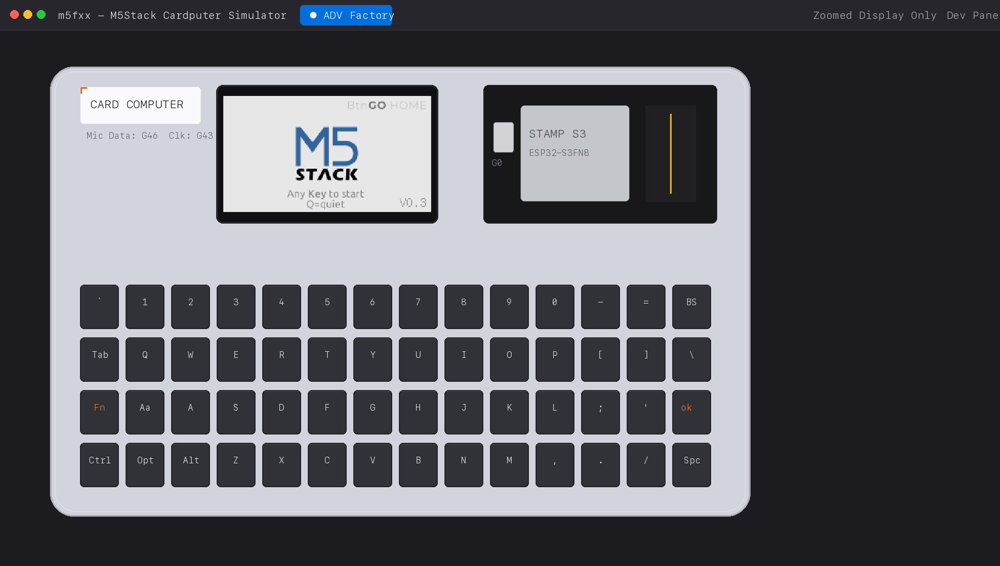
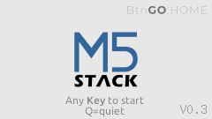
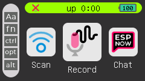
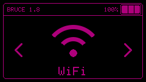
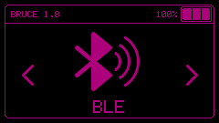

<div align="center">


# m5fxx — M5Stack Cardputer Desktop Simulator

[](CHANGELOG.md)
[](https://www.rust-lang.org/)
[](https://github.com/pepperonas/m5fxx)
[](https://opensource.org/licenses/MIT)
[](https://github.com/pepperonas/m5fxx)
[](https://docs.m5stack.com/en/core/Cardputer)
[](https://github.com/pepperonas/m5fxx)
[](https://github.com/pepperonas/m5fxx)

*Ein hochperformanter, plattformübergreifender Desktop-Simulator für M5Stack-Cardputer-Firmware mit nativer Benutzeroberfläche in Rust (`eframe`/`egui`).*

[Features](#1-features--highlights) • [Hardware-Status](#2-hardware-status-unterstützt-vs-ausstehend) • [Schnellstart](#3-schnellstart--terminal-alias) • [Architektur](#4-architektur--firmware-integration) • [Changelog](CHANGELOG.md) • [Plattformen](#5-plattform-support--builds)

</div>

---

## 1. Features & Highlights

- 🕹️ **Authentische M5Stack Cardputer Hardware-Nachbildung:**
  - Originalgetreues Industrie-Gehäuse im warmen Cardputer-Hellgrau (`#D1D4DC`) mit Schattenwürfen, Kantenfasen und präzisen Port-Aussparungen (USB-C Buchse rechts, MicroSD-Schacht links).
  - **Oberer linker Bereich:** Weißes `[ CARD COMPUTER ]` Badge mit orangefarbenen Eckwinkeln, PDM-Mikrofonbeschriftung (`Mic Data: G46 Clk: G43`), 2 ovalen Akustikschlitzen und Lautsprecher-Öffnungen.
  - **Mitte (Display):** Schmaler schwarzer Displayrahmen um die CAD-basierte Öffnung. Modifier- und Statusanzeigen gehören zu den Firmware-Pixeln im LCD.
  - **Oberer rechter Bereich:** Detailreiches M5Stamp-S3 Modul mit schwarzer Leiterplatte, 2.4GHz Mäander-Goldantenne, laser-beschriftetem RF-Shield (`STAMP S3 / ESP32-S3FN8`), farbkodierten GPIO-Dots und taktilem **BtnG0**-Taster.
  - Zentrierte, stufenlos skalierbare Geräteansicht mit optimierter HiDPI- und Retina-Unterstützung.
- 📺 **ST7789V2 IPS LCD Emulation:**
  - Echte Hardware-Auflösung von 240 × 135 Pixeln mit RGB565-Farbraum.
  - **Nearest-Neighbor GPU-Texturierung:** Absolut scharfe Pixel-Optik ohne verwaschene Filter.
  - **Zoomed Display Only Modus:** Großansicht des reinen Displays mit ganzzahligem Skalierungsfaktor (Integer Scaling).
- ⌨️ **Vollständige 56-Tasten-Tastatur & Modifier-Unterstützung:**
  - Exakte 4×14 Tastenmatrix mit weißen Beschriftungen, orangefarbenen Pfeilsymbolen (`▲`, `▼`, `◄`, `►`) und orangefarbenem `ok ↵` auf der Enter-Taste.
  - **Funktionierende Modifier (`Shift`, `Ctrl`, `Alt`, `Fn`):**
    - Physische PC-Modifier (`Shift`, `Ctrl`, `Alt`) werden in Echtzeit auf die Cardputer-Matrix übertragen (`Aa` auf (2, 1), `Ctrl` auf (3, 0), `Alt` auf (3, 2)) und steuern die Modifier-Anzeigen der Firmware sowie die Großschreibung.
    - `Fn`-Taste kann über `F1` (oder Mausklick auf die `Fn`-Taste) aktiviert werden, um die Funktions- und F-Tasten-Ebenen (`F1`..`F12`, `Esc` etc.) zu schalten.
  - **Direkte Host-Navigation:** Pfeiltasten (`ArrowUp`, `ArrowDown`, `ArrowLeft`, `ArrowRight`), `Enter`, `Esc`, `Tab` und `Backspace` steuern Firmware und Menüs unmittelbar auf der PC-Tastatur (kein umständliches `Fn`-Drücken für Pfeiltasten nötig).
  - Klickbare Tastenkappen mit optischem Leuchteffekt (M5-Orange) bei Druck.
  - Internationales Layout & Unicode-Unterstützung (QWERTZ & QWERTY).
  - **Focus-Loss-Safety:** Automatisches Zurücksetzen aller Tastenzustände bei Fokusverlust, um Hängenbleiben zu verhindern.
- 💾 **MicroSD-Speicherkarte mit Sandbox:**
  - Abbildung auf ein konfigurierbares Host-Verzeichnis.
  - Zuverlässiger Schutz vor Directory-Traversal-Angriffen (`../` oder Ausbrüche blockiert).
- ⚡ **ESP32-S3-Firmware tatsächlich ausführen:**
  - Zusammengeführte `.bin`-Images mit Bootloader, Partitionstabelle und Anwendung per Drag-and-Drop oder Dateiauswahl laden.
  - Öffentlicher Espressif-QEMU mit Cardputer-Erweiterung führt den Xtensa-Code aus; SPI-LCD-Daten gelangen in den ST7789-Controller.
  - Verifiziert mit **Bruce 1.8**: Bootlogo, Hauptmenü und Navigation von WiFi zu BLE.
  - Reales UART-/Emulatorlog, Pause und Neustart sind im Developer Panel verfügbar.
  - Zuletzt importierte Images lassen sich innerhalb der Sitzung erneut starten. Die Quelldatei bleibt unverändert.
- 🛠️ **Integriertes Entwickler-Panel:**
  - Simulation pausieren & fortsetzen.
  - Firmware- und HAL-Reset.
  - Live-Anzeige gedrückter Tasten & Modifier (`Fn`, `Shift`, `Ctrl`, `Opt`, `Alt`).
  - Native Ordnerauswahl für die virtuelle SD-Karte via Dateidialog.
  - Umschaltung zwischen **Original Cardputer** (GPIO-Matrix) und **Cardputer ADV** (TCA8418 I²C-Controller).

### Firmware-Ansichten im Simulator

#### 1. M5Stack Stock-/Werksfirmware Boot & Launcher (ADV Factory)

Der Simulator startet die originale M5Stack Cardputer ADV Werksfirmware nativ in C++/M5GFX mit M5Stack-Bootlogo und Mooncake-Launcher:

<div align="center">
  
</div>

| Stock Boot-Screen (`boot.png`) | Mooncake Launcher (`launcher.png`) |
| :---: | :---: |
|  |  |
| *M5Stack Logo & Firmware V0.3* | *App-Launcher mit Statusleiste & Modifiern* |

#### 2. Bruce Firmware Live-Ausführung (ESP32-S3 QEMU)

Der Emulator führt echten ESP32-S3-Maschinencode (z. B. Bruce 1.8) über das integrierte QEMU-Modell aus und leitet die SPI-Daten direkt an das emulierte ST7789-IPS-Display weiter:

| 1. Boot-Logo & Initialisierung | 2. Hauptmenü (WiFi) | 3. Live-Navigation (BLE) |
| :---: | :---: | :---: |
|  |  |  |
| *Live-Ausführung von `bruce.bin`* | *M5GFX-Menüausgabe im ST7789-Display* | *Navigiert über Pfeiltastenmatrix* |

---

## 2. Hardware-Status: Unterstützt vs. Ausstehend

Die drei Laufzeitprofile haben unterschiedliche Hardwarepfade. Ein sichtbares Funkmenü bedeutet keine funktionierende Funkhardware.

| Komponente | Native ADV Factory / Rust Demo | ESP32 Binary (QEMU) |
| :--- | :--- | :--- |
| ST7789V2, 240 × 135 | Controller-Befehlssatz und RGB565 | GPSPI-/DMA-Daten an denselben Controller |
| Tastatur / G0 | Matrix und native ADV-Anbindung | Original-Cardputer-GPIO-Matrix und G0 |
| CPU / Zeit | Native Logik, virtuelle Zeit | ESP32-S3-Xtensa-Code und QEMU-Timer |
| Helligkeit / Akku | Simulierte Werte | LEDC-Helligkeit, synthetischer ADC-Akkuwert |
| MicroSD | Lokale SD-Sandbox | Noch nicht angebunden |
| Audio / Mikrofon | Stubs bzw. synthetische ADV-Eingaben | Noch nicht vollständig emuliert |
| Wi-Fi / ESP-NOW / BLE | Keine Host-Funkverbindung; ADV-Testzustände | Keine funktionsfähige Funkemulation |
| Grove / externe Module | Nicht implementiert | Nicht implementiert |
| ADV-TCA8418 in Binärfirmware | Nativer ADV-Port unterstützt | Noch nicht modelliert |

Hardwareabhängige Firmware-Funktionen können in QEMU fehlschlagen oder warten. Die geprüfte Kompatibilität umfasst Bruce 1.8 beim Booten und der Menübedienung, nicht sämtliche Bruce-Funktionen.

---

## 3. Schnellstart & Terminal-Alias

### Starten über Terminal-Alias
Wenn du den Alias `m5` in deiner Shell eingerichtet hast:
```bash
m5
```

### Manueller Start über Cargo
```bash
# Debug-Build
cargo run -p m5fxx-desktop

# Optimierter Release-Build
cargo run --release -p m5fxx-desktop
```

### ESP32-Binärfirmware starten

Einmalig den angepassten öffentlichen QEMU bauen:

```bash
./tools/qemu/build.sh
cargo run -p m5fxx-desktop
```

Dann ein **zusammengeführtes ESP32-S3-`.bin`-Image** auf das Fenster ziehen oder im Developer Panel auswählen. Nach dem Import startet **ESP32 Binary** automatisch. Einzelne App-Images, `.hex` und `.elf` werden nicht unterstützt. Build-Abhängigkeiten und Fehlerhilfe: [QEMU-Setup](tools/qemu/README.md). Architektur und Grenzen: [ESP32-Emulation](docs/esp32-emulation.md).

### Bedienung der Geräteansicht

Die Standardansicht zeigt das vollständige Gerät mit dem laufenden Firmware-Display. Klicke auf eine Tastenkappe oder verwende die Host-Tastatur zur Eingabe; der kleine **G0**-Taster unter der Gerätebeschriftung ist ebenfalls bedienbar.

Über **Zoomed Display Only** in der oberen Leiste wechselst du zur vergrößerten Displayansicht mit ganzzahliger Pixelskalierung. **Developer Panel** blendet die seitlichen Entwicklungswerkzeuge ein oder aus. Das Profil **ADV Factory** startet den nativen Port der originalen ADV-Werksfirmware. **Rust Demo** startet die bisherige Beispielanwendung; dort lässt sich zwischen Original Cardputer und Cardputer ADV wechseln; die Gerätebeschriftung folgt dem ausgewählten Modell, während beide dieselbe ADV-inspirierte Gehäuseansicht verwenden.

---

## 4. Architektur & Firmware-Integration

Das Projekt ist modular als **Cargo-Workspace** aufgebaut:

```text
m5fxx/
├── assets/                  # Hero Banner & Ressourcen
├── crates/
│   ├── m5fxx-core/          # Hardware Abstraction Layer, RGB565, Input & SD Sandbox
│   ├── m5fxx-esp32/         # QEMU-Prozess, Flash-Import und LCD-/Tastenbrücke
│   ├── m5fxx-factory/       # Nativer C/C++-Port der ADV-Werksfirmware
│   ├── m5fxx-app-demo/      # Hardware-agnostische Beispielanwendung (Firmware)
│   └── m5fxx-desktop/       # eframe/egui GUI Desktop-Simulator
├── tools/qemu/              # Reproduzierbarer öffentlicher QEMU-Build und Board-Modell
├── docs/                    # Emulationsdetails und Mockups
├── include/
│   └── m5fxx_abi.h          # C-ABI Header für native C/C++ Firmware-Integration
├── Cargo.toml               # Workspace Konfiguration
└── README.md
```

### Originale ADV-Werksfirmware

`m5fxx-factory` kompiliert die originalen C/C++-Anwendungen und M5GFX nativ. Dazu wird ein C/C++17-Compiler benötigt (macOS: Xcode Command Line Tools). Dieses Profil führt die Werksfirmware nativ mit virtueller Zeit und simulierten Peripheriegeräten aus. Das separate Profil **ESP32 Binary** führt importierten ESP32-S3-Maschinencode in QEMU aus.

Das Developer Panel bietet Neustart, Display-Zustände, Helligkeit und simulierte Eingaben. Die Zoomansicht verwendet ganzzahlige **Monitorpixel**, auch auf HiDPI-Displays. Die vollständige Geräteansicht skaliert dagegen zusammen mit dem Gehäuse.

Details, Quellen und Grenzen stehen in [Display-Fidelity](docs/display-fidelity.md). Abhängigkeiten sind in [vendor/versions.json](vendor/versions.json) festgeschrieben.

### Integration eigener Firmware

#### A. Firmware in Rust
Nutze `m5fxx-core` als gemeinsame Abhängigkeit:
```toml
[dependencies]
m5fxx-core = { git = "https://github.com/pepperonas/m5fxx" }
```
Deine Firmware implementiert ihre Logik gegen `CardputerHal`. Auf dem Desktop läuft sie im Simulator, auf der echten Hardware mit `esp-hal` oder `esp-idf-hal`.

#### B. Firmware in C oder C++
Für bestehende Arduino- oder ESP-IDF-Codebasen liegt der schlanke C-Header [`include/m5fxx_abi.h`](include/m5fxx_abi.h) bereit:
1. Kompiliere deine hardware-unabhängigen Firmware-Module (Menüs, Logik) als native Library.
2. Verbinde den Framebuffer (`get_framebuffer()`) und Key-Events (`m5fxx_key_event_t`) über die definierte C-ABI.
3. Kein Nachprogrammieren riesiger Arduino-Bibliotheken erforderlich.

---

## 5. Plattform-Support & Builds

| Betriebssystem | Architektur | Status | Build-Kommando |
| :--- | :--- | :---: | :--- |
| **macOS** | Apple Silicon (M1–M4) | ✅ Verifiziert | `cargo build --release -p m5fxx-desktop` |
| **macOS** | Intel x86_64 | Quellcode-kompatibel, QEMU-Pfad nicht verifiziert | `cargo build --release -p m5fxx-desktop` |
| **Linux** | Ubuntu, Debian, Fedora, Arch | 🐧 Quellcode-kompatibel | `cargo build --release -p m5fxx-desktop` |
| **Windows** | x86_64 MSVC | 🪟 Quellcode-kompatibel | `cargo build --release -p m5fxx-desktop` |

Der neue QEMU-Firmwarepfad wurde auf **macOS Apple Silicon** geprüft. Andere Plattformen sind für diesen Pfad noch nicht verifiziert.

### Linux Abhängigkeiten (Ubuntu/Debian)
```bash
sudo apt-get update
sudo apt-get install -y libxcb-render0-dev libxcb-shape0-dev libxcb-xfixes0-dev libxkbcommon-dev libssl-dev
```

---

## 6. Tests & Code-Qualität

```bash
# Alle Workspace-Tests ausführen
cargo test --workspace

# Linter & Formatierung
cargo clippy --workspace -- -D warnings
cargo fmt --all -- --check
```

---

## Lizenz

Die eingebundenen Drittanbieterquellen behalten ihre jeweiligen Lizenzen und Copyright-Hinweise; siehe [vendor/README.md](vendor/README.md). Der separate QEMU-Build und das Cardputer-Board-Modell stehen unter GPL-2.0-or-later; siehe [QEMU-Setup](tools/qemu/README.md).
